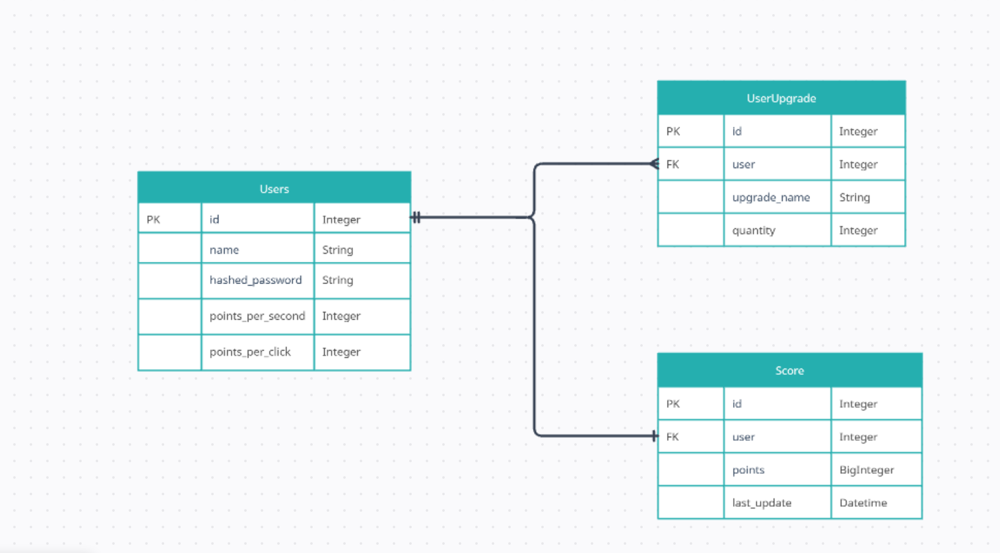

# Projekty pro přijímací zkoušky na Gymnázium Arabská

Tento repozitář byl vytvořen jako ukázka programátorských dovedností autora v rámci přípravy na srovnávací zkoušky na Gymnázium Arabská.

Repozitář obsahuje tři samostatné projekty:

1. **Konvertor měn v příkazové řádce**
2. **Hra Pexeso**
3. **Jednoduchý Cat Clicker vytvořený v Django**

---

# Instalace

Před spuštěním kteréhokoliv projektu doporučuji nainstalovat potřebné závislosti:

```bash
pip install -r requirements.txt
```
# 1. Konvertor měn

Aplikace slouží ke konverzi měn v příkazové řádce.

Projekt obsahuje dvě verze:

- **v1** — používá externí API poskytnuté vyučujícím
- **v2** — používá API vybrané autorem repozitáře a implementované speciálně pro něj

## Rychlé spuštění

Připravte .env: 

```bash
cp kurzkonverter/{v1 nebo v2}/.env_example kurzkonverter/{v1 nebo v2}/.env
```

Spusťte aplikaci:

```bash
python kurzkonverter/{v1 nebo v2}/src/main.py
```

---

# 2. Pexeso

Jednoduchá implementace populární paměťové hry Pexeso.

## Funkce

- 2 úrovně obtížnosti
- 2 různé vzhledy karet
- možnost nastavení počtu dvojic

## Rychlé spuštění

Otevřete soubor:

```text
pexeso/index.html
```

v libovolném webovém prohlížeči.

---

# 3. Cat Clicker (Django projekt)

Jednoduchá hra inspirovaná Cookie Clickerem vytvořená pomocí frameworku Django.

## Funkce

- registrace a přihlášení uživatelů
- obchod s vylepšeními
- pasivní získávání bodů
- systém upgradů

## Databázové schéma


## Atributy modelů

```bash
class User(models.Model):
    id = models.AutoField(primary_key=True)
    name = models.CharField(max_length=100, unique=True)
    hashed_password = models.CharField(max_length=255)
    points_per_second = models.IntegerField(default=0)
    points_per_click = models.IntegerField(default=1)


class UserUpgrade(models.Model):
    id = models.AutoField(primary_key=True)
    user = models.ForeignKey(User, on_delete=models.CASCADE, related_name='upgrades')
    upgrade_name = models.CharField(max_length=100)
    quantity = models.PositiveIntegerField(default=0)

class Score(models.Model):
    id = models.AutoField(primary_key=True)
    user = models.OneToOneField(User, on_delete=models.CASCADE, related_name='score')
    points = models.BigIntegerField(default=0)
    last_updated = models.DateTimeField(default=timezone.now)
```
## Rychlé spuštění

```bash
cd catclicker
```

```bash
python manage.py migrate
```

```bash
docker-compose up --build
```

Aplikace bude spuštěna na http://127.0.0.1:8000/ nebo http://localhost:8000/.

---

# Použité technologie

- Python
- Django
- Redis
- SQLite
- HTML / CSS / JavaScript
- Docker
- REST API

---

Projekt byl vytvořen jako studijní a demonstrační portfolio.


